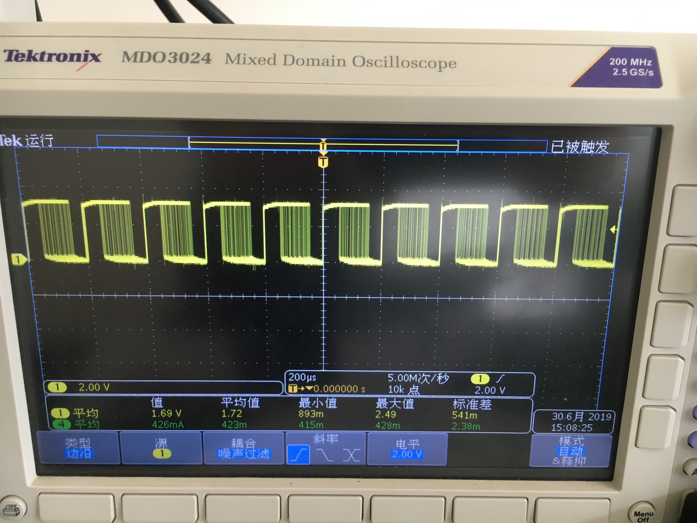
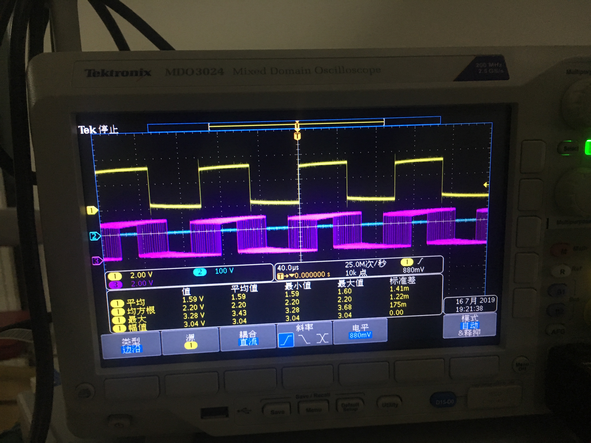

#### Recently, I found a problem in using oscilloscope.
#### I wanted to detect a SPWM waveform but the display was always wrong.
#### At the beginning, I thought it was because of my code's error. but no matter how I modified my code, the problem still exsited.

#### Finally, I found it was caused by the triggering mode of oscilloscope, it was set as rising edge mode as default.
#### So I switch the source to a square wave，the display became normal.

***
---
___
#### back to the main page, please click [here](jhruan.github.io) 
